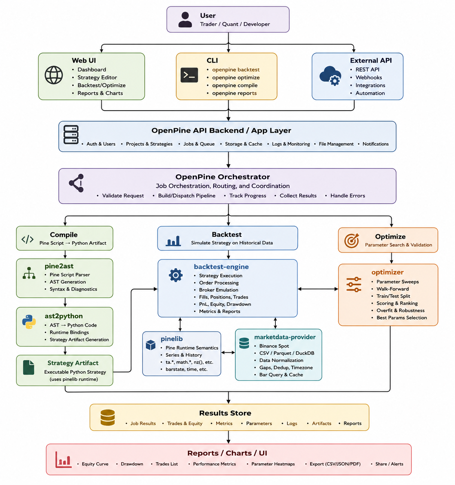
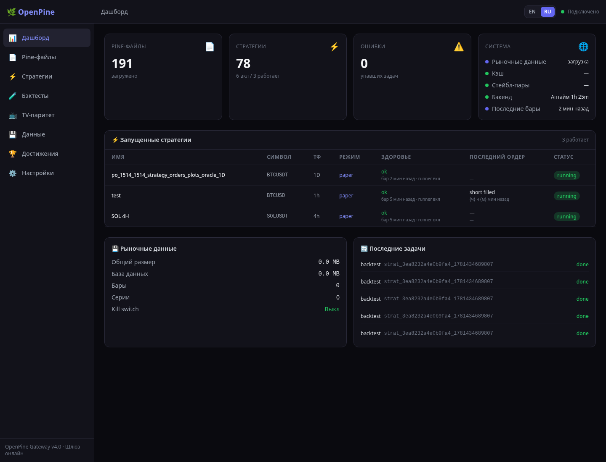
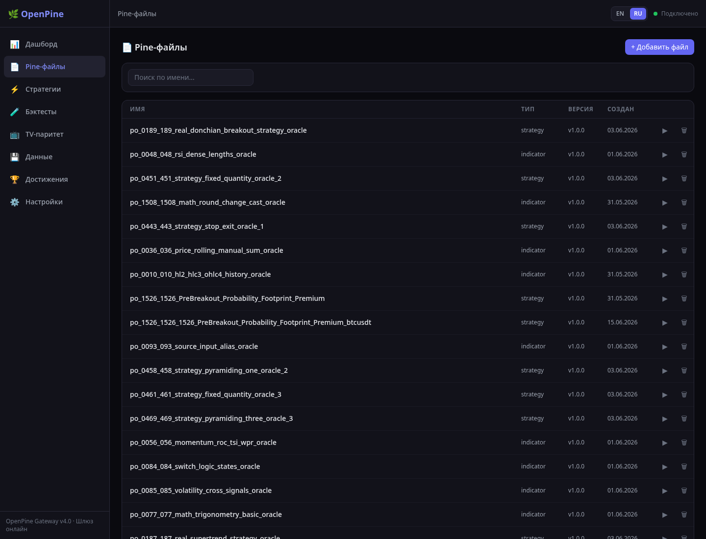
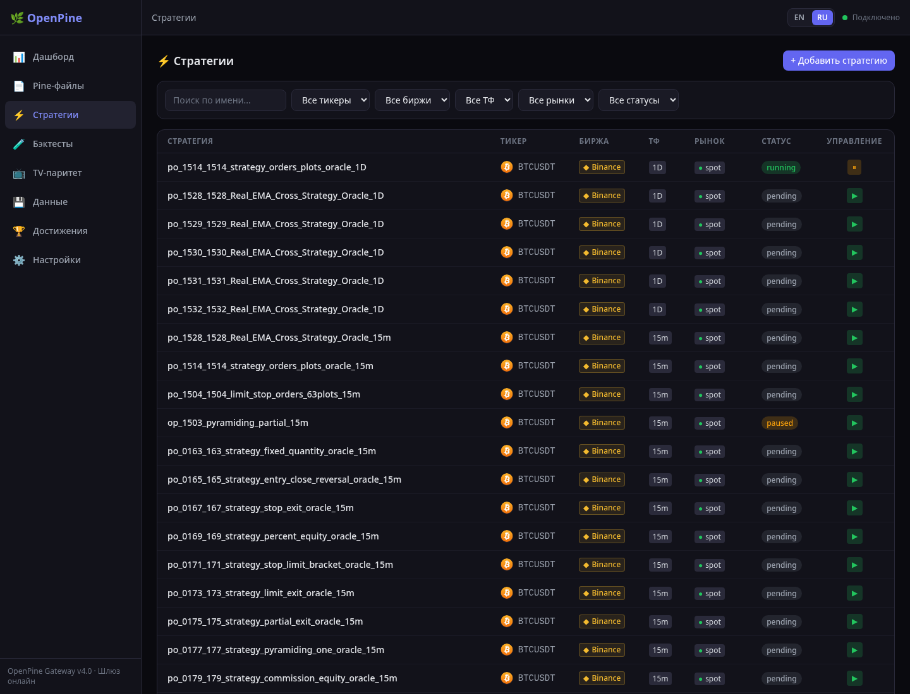
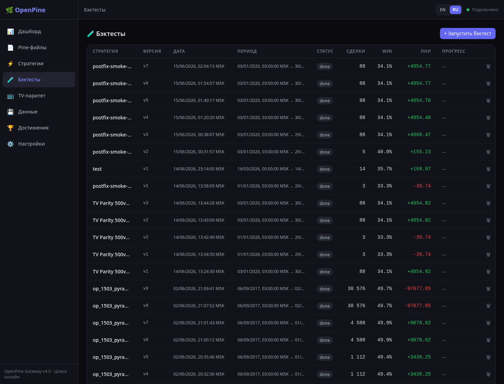
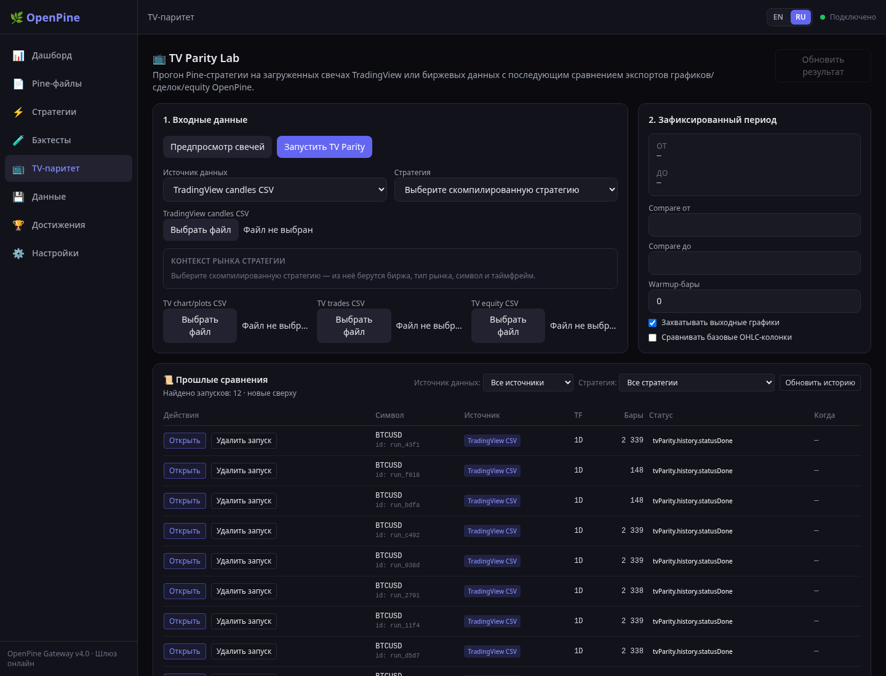
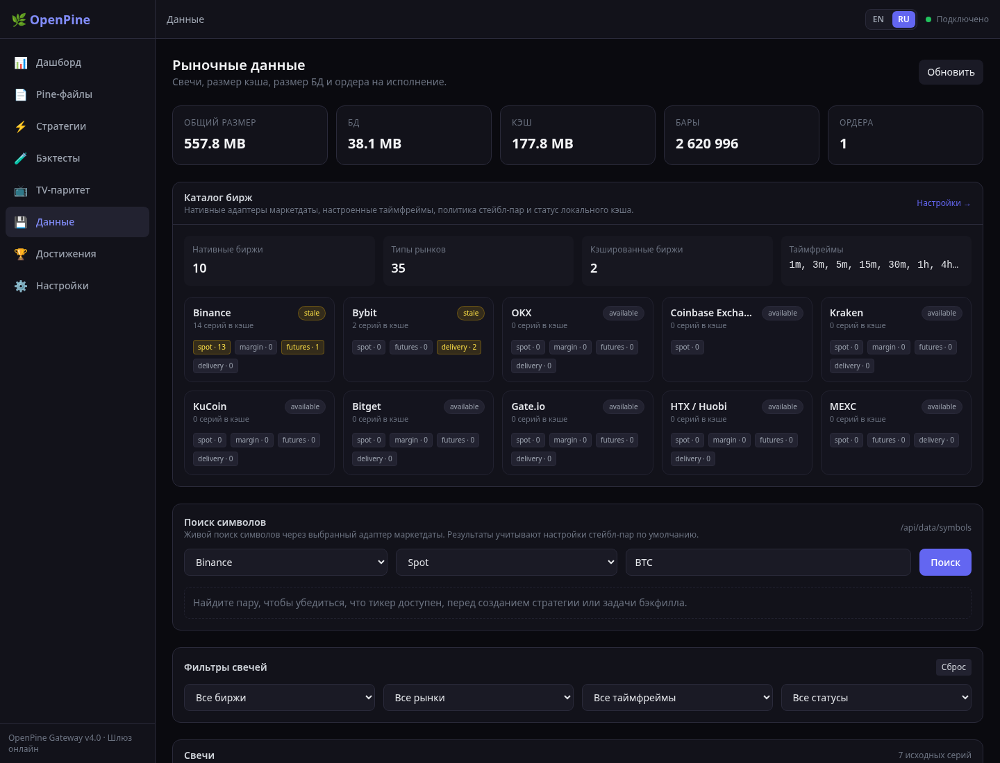
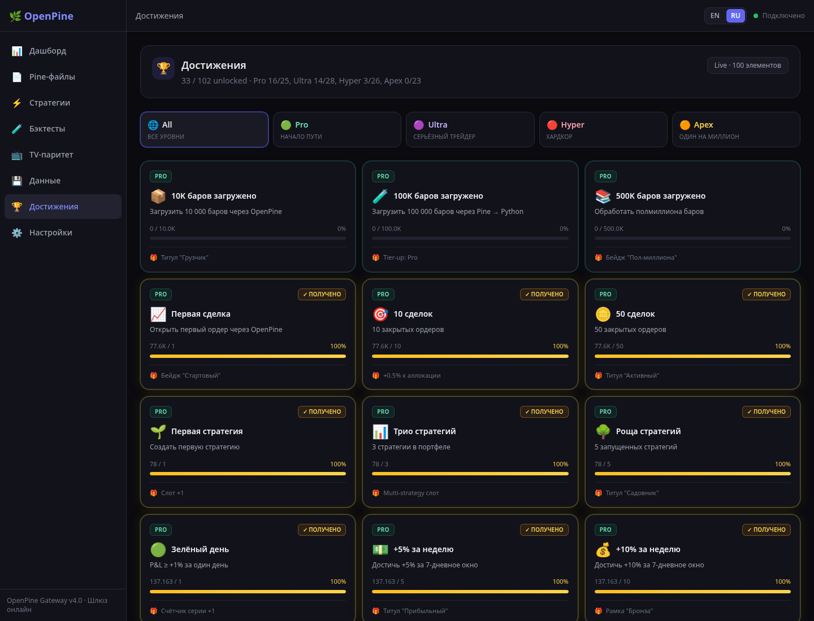
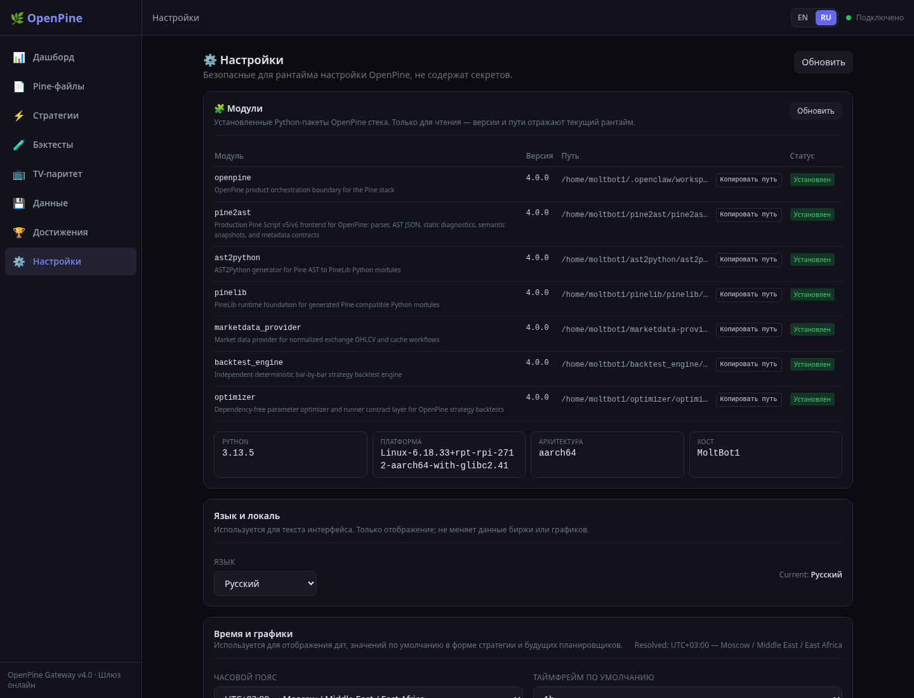

# OpenPine 4.0.0



**Quick tour of the OpenPine UI** (click a tab to expand):

<details open>
<summary>🗂  Architecture diagram</summary>


</details>

<details>
<summary>📊  Dashboard</summary>



</details>

<details>
<summary>📄  Pine files</summary>



</details>

<details>
<summary>⚡  Strategies</summary>



</details>

<details>
<summary>🧪  Backtests</summary>



</details>

<details>
<summary>📺  TV parity</summary>



</details>

<details>
<summary>💾  Data</summary>



</details>

<details>
<summary>🏆  Achievements</summary>



</details>

<details>
<summary>⚙️  Settings</summary>



</details>


**GitHub description:** OpenPine orchestrates the Pine research stack: Pine source registry, Pine2AST, AST2Python, PineLib runtime, deterministic backtests, market data, optimization, paper/live adapters, FastAPI gateway, and local product storage.

**Suggested topics:** `pine-script`, `tradingview`, `backtesting`, `algorithmic-trading`, `market-data`, `strategy-optimization`, `fastapi`, `sqlite`, `python`.

OpenPine is the backend/product orchestration layer for the Pine research stack. It connects Pine source management, `pine2ast`, `ast2python`, `pinelib`, `backtest-engine`, `marketdata-provider`, `optimizer`, local SQLite state, FastAPI gateway routes, workers, paper/live execution adapters, and operational CLIs.

The Vue/Vite dashboard lives in `openpine-ui/`. This backend release intentionally keeps the UI surface unchanged and focuses on the Python package, database boundary, compile/runtime integration, storage, release hygiene, and documentation.

## Stack Boundary

OpenPine does not reimplement parser/runtime/backtest/data/optimizer internals. Those stay in independently versioned packages:

- `pine2ast @ v4.0.0`
- `ast2python @ v4.0.0`
- `pinelib @ v4.0.0`
- `backtest-engine @ v4.0.0`
- `marketdata-provider @ v4.0.0`
- `optimizer @ v4.0.0`

OpenPine is responsible for orchestration: registering Pine sources, compiling strategies, attaching market data, scheduling backtests/jobs, storing results, exposing gateway APIs, and coordinating paper/live execution.

## Repository Layout

```text
openpine/                 Python backend package
  accounts/               account and API-key models
  artifacts/              compiled artifact storage
  batch/                  TradingView corpus/batch runner utilities
  cli/                    Click command groups
  compile/                pine2ast -> ast2python adapter boundary
  config/                 workspace-relative configuration
  data/                   marketdata-provider orchestration
  execution/              paper/live execution adapters
  gateway/                FastAPI gateway and route modules
  jobs/                   local job scheduling
  orders/                 order persistence and models
  pine/                   Pine source registry
  registry/               strategy registry
  runtime/                backtest-engine adapter boundary
  state/                  trusted runtime snapshot state
  storage/                SQLite storage and migrations
  streams/                live market-data subscriptions
  workers/                background fanout/job executors
openpine-ui/              Vue/Vite dashboard; not changed by backend gates
docs/                     backend architecture/release documentation
scripts/                  backend release and smoke scripts
tests/                    backend test suite
```

## Install

```bash
python -m venv .venv
. .venv/bin/activate
python -m pip install --upgrade pip
python -m pip install -e '.[dev]'
```

For source-stack development, install sibling libraries first in dependency order:

```bash
python -m pip install -e ../pine2ast
python -m pip install -e ../marketdata-provider
python -m pip install -e ../pinelib
python -m pip install -e ../ast2python
python -m pip install -e ../backtest_engine
python -m pip install -e ../optimizer
python -m pip install -e .
```

## Run Backend

```bash
python -c "from openpine.gateway.server import create_app; import uvicorn; uvicorn.run(create_app(), host='0.0.0.0', port=8080)"
```

Pickle snapshots are disabled by default. Set `OPENPINE_ALLOW_PICKLE_STATE=1` only when reading trusted local legacy snapshots.

CLI:

```bash
openpine --help
python -m openpine --help
```

## Database

SQLite is the local product database. Migrations live under `openpine/storage/migrations/`. Release 4.0 adds `openpine_schema_metadata` with the schema contract marker `openpine.sqlite.v4`. See `docs/DATABASE.md`.

## Release Gate

```bash
bash scripts/release_gate.sh
```

The backend gate runs compileall, `ruff --select F,E9`, pytest+coverage, duplicate/architecture checks, distribution manifest, release manifest, and import smoke. UI audit/test/build is intentionally separate and should be run from `openpine-ui/`.

## 4.0 Coverage Baseline

The backend gate now enforces a 90% package coverage floor after the large CLI strategy/data lifecycle, marketdata provider-adapter, exchange-metadata, stream-adapter, TV-corpus, compare-helper, gateway/storage/execution, Telegram, runtime-adapter, optimizer-route, and gateway-lifespan, state CLI, Telegram polling, storage-adapter, and strategy lifecycle hardening pass. This is still a backend-only baseline for the product repository; later passes should continue raising it while decomposing the remaining legacy CLI, batch, live-runner, and Telegram surfaces.


## Timezone configuration

OpenPine stores all timestamps as UTC milliseconds. User-facing date-only CLI/API inputs are interpreted in the configured default timezone. The default keeps the historical product behavior: `UTC+03:00` labelled `MSK`. Configure it in `.openpine/config.yaml` or with `OPENPINE_TIMEZONE`:

```yaml
timezone: UTC+03:00
```

Supported values include `UTC`, `MSK`, fixed offsets such as `UTC+03:00`, and IANA names such as `Europe/Moscow`. Use explicit ISO offsets, for example `2024-01-01T00:00:00Z`, when an API caller needs timezone-independent boundaries.


### SQLite storage health

Run `openpine storage migrate` and `openpine storage health` before deployment. The health command verifies the `openpine.sqlite.v4` contract, pending migrations, required indexes, and durable-event compatibility.

## License

MIT. See `LICENSE`.

## Support

OpenPine development is independent and MIT-licensed. Support is optional and does not change license terms, feature access, or project guarantees.

- Telegram: https://t.me/OpenPine
- TON: `UQAyIr2sQ4-_Q5L-4VINcU18khDas5GPbAlYEkQN6S_qzui2`
- SOL: `EbxMUK2W4RGeQZCTRFrdgpEJvnqtyczPZvBrQa1cYJnQ`
